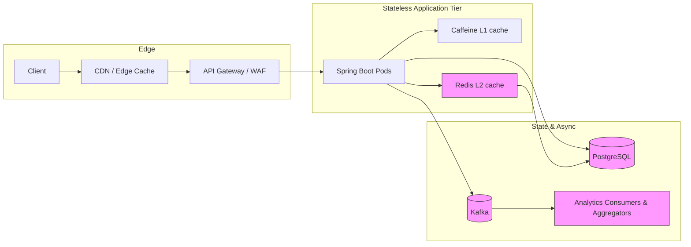

# Architecture

## Diagram

Note: Mermaid clickable links reference the local docker-compose for runtime images.

## Request path

Client -> CDN/Edge -> API Gateway/WAF (rate limiting) -> stateless Spring Boot pods
  - Pod-local Caffeine L1 for per-pod hot-key coalescing
  - Redis L2 (circuit breaker) for cross-pod caching and negative cache
  - PostgreSQL as source-of-truth for mappings and uniqueness constraints
  - Kafka for asynchronous analytics events and downstream consumers

## Hot URL strategy

Database partitioning spreads **different URLs** but does not solve one viral key. The hot-key design is hierarchical:

1. CDN/edge absorbs global repeated redirects.
2. Caffeine L1 absorbs repeated requests per pod and prevents one Redis key from becoming the only hot dependency.
3. Redis L2 protects PostgreSQL across pods.
4. Caffeine atomic `get(key, loader)` provides per-pod request coalescing after expiry/miss.
5. Negative Redis caching protects PostgreSQL from repeated invalid-code enumeration.
6. Analytics uses `shortCode:salt` Kafka keys so one viral URL can use multiple Kafka partitions because strict ordering is unnecessary for aggregates.

Future datastore partitioning should hash the random short code for even aggregate distribution. It is not a single-hot-key solution.

## Consistency boundaries

Strong correctness:
- short-code uniqueness
- canonical normalized-URL uniqueness
- custom-alias uniqueness
- idempotency key semantics
- status/expiration checks

Eventual consistency:
- access count
- last-accessed timestamp
- geo analytics

## Failure behavior

- Redis down: circuit breaker opens; read falls through to PostgreSQL.
- PostgreSQL down during create: create fails; Redis is never treated as durable storage.
- PostgreSQL down during redirect with L1/Redis hit: cached active URL may continue until bounded TTL; documented availability/consistency trade-off.
- Kafka/analytics down: redirect succeeds; analytics delivery is decoupled from the primary path.

## Notes
- Runtime versions referenced in the README (docker-compose images) help operators reproduce the environment: Postgres 16, Redis 7, Kafka 3.9.1.
- Application build: Java 21, Spring Boot 3.5.4 (see pom.xml)
